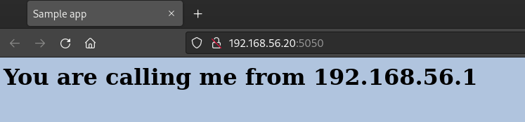
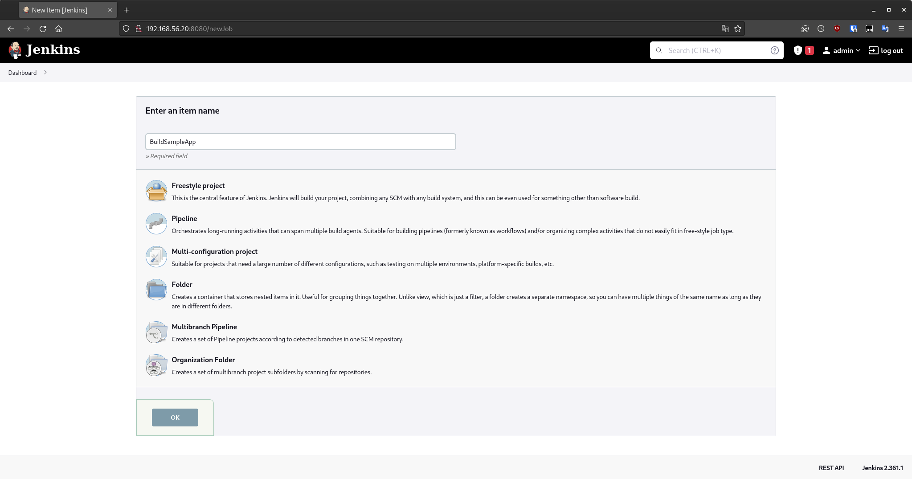
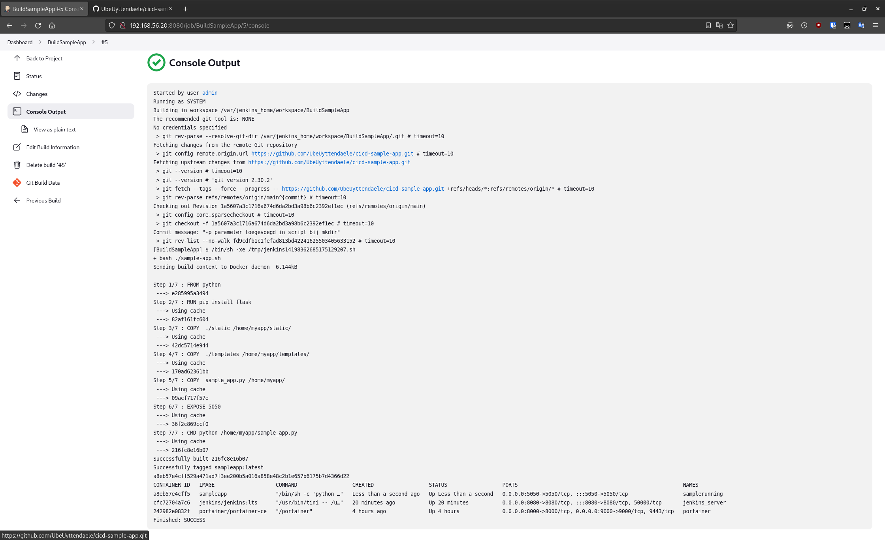
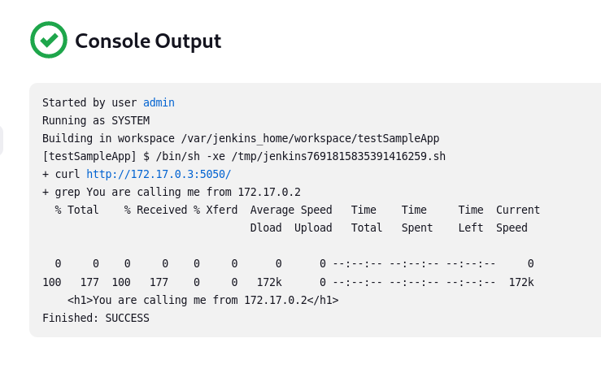
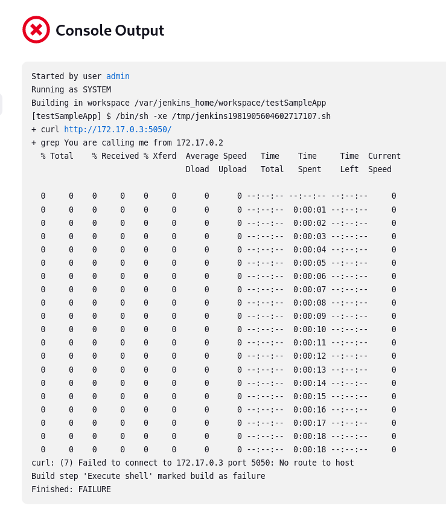
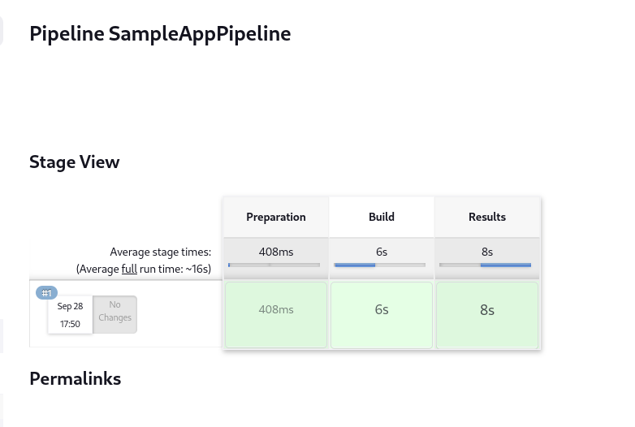

# Lab Report: Continuous Integration/Delivery With Jenkins
## Problems:
### Installing vagrant
With installing all the required software. I found out that the Fedora repositories don't include the latest version of vagrant. This was something I had to noticed since when I did vagrant up, I got an error that basically said that the vagrant file wasn't compatible with the older version of the software. I fixed this by adding the hashicorp repository to my repository list and installing it directly from the developers.
## 1.1 Set up the lab environment
I did this by creating a new folder and copying the files found in the origininal repository.

After I initialized the folders as a git repository with

```
	git init
	git add .
	git commit -m Initial
	git brach -M main
	git remote add origin git@github.com:UbeUyttendaele/cicd-sample-app.git
	git push -u origin main
```
## 1.2 Build and verify the sample application
First I startup the the VM using **vagrant up**.
Then I used **vagrant ssh** to establish an ssh connection and went to the /vagrant/cicd-sample-app directory. I added execute permission using **chmod +x sample-app.sh** and executed the script using **./sample-app.sh**. After running the script I could access the webpage that was running in the docker container on my host device (http://192.168.56.20:5050/).

After testing, I stopped the testing docker using **docker container stop samplerunning** and removed it using **docker container rm samplerunning** or **docker container prune**.



## 1.3 Download and run the Jekins Docker image
First I installed the docker container using the code provided to us.

```
Login Details
username:
admin
password:
7266b9df94a941cba102821b57b02917
```

## 1.4 Configure Jekins
In this step I followed the instructions provided to initialize the jenkins evironment.


## 1.5 Use Jenkins to build your application
I got the build to run succesfully. After building it for the first time and atempting it again wil result in an error that says that a docker container with that name is already exists. To solve this you need to stop and remove the old container. Afterwards I found out that in the script it doesn't check if a certain directory already exists. So when it runs it gives an error stating that the directory already exists. I've solved this by editing the script and adding the -p parameter to the mkdir command.




## 1.6 Add a job to the test application
First I tried to find the ip adresses of the containers. I found those with the **docker inspect** command. The ipaddress of the jenkins server was 172.17.0.2 and the sampleapp's ip address was 172.17.0.3 .

After that I followed the steps provided and executed the text successfully.



Then I tried the test after removing the samplerunning container. To which it returned an error that marked that the container could not be found.


## 1.7 Create a build pipeline
After following the steps and filling in the correct names for my jobs. The pipeline got succesfully completed.


## Make a change in the application

## Resources

List all sources of useful information that you encountered while completing this assignment: books, manuals, HOWTO's, blog posts, etc.
